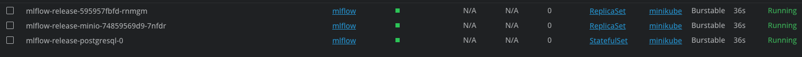
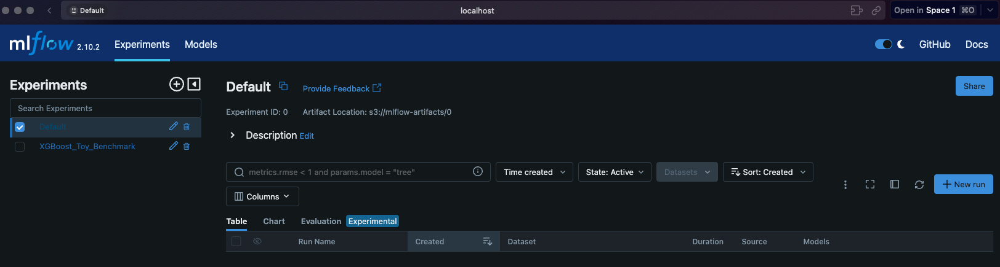
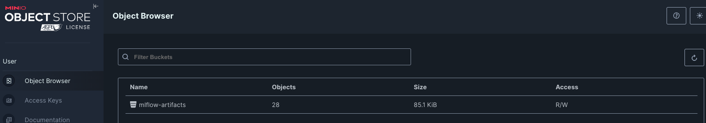
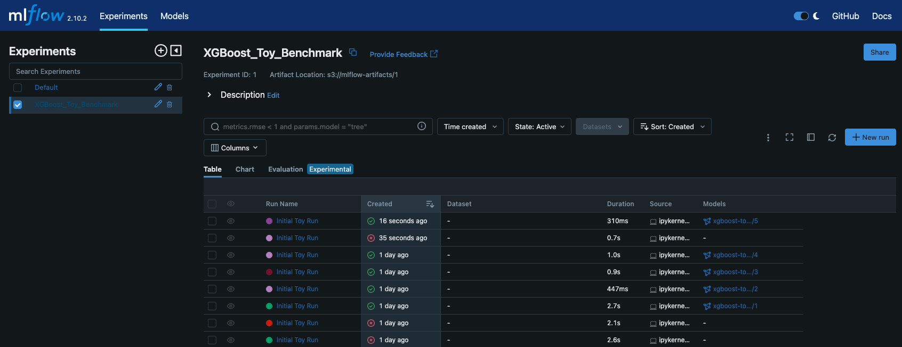
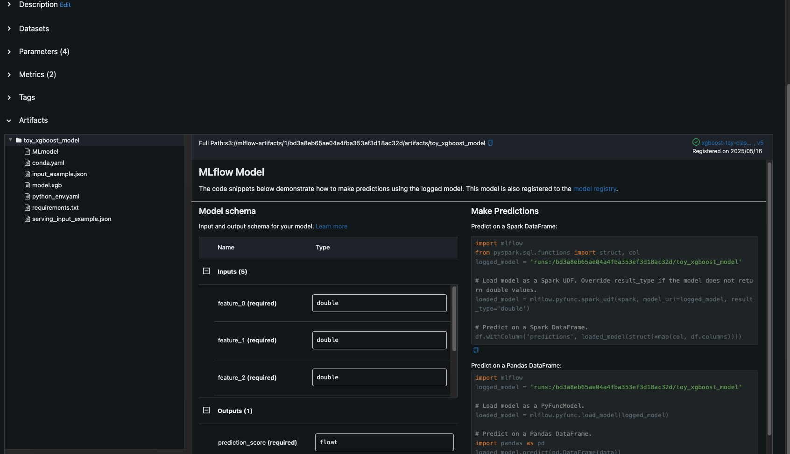
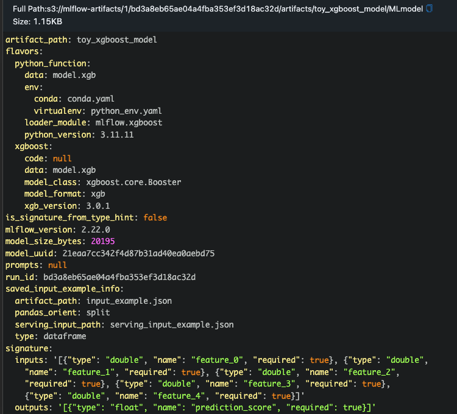
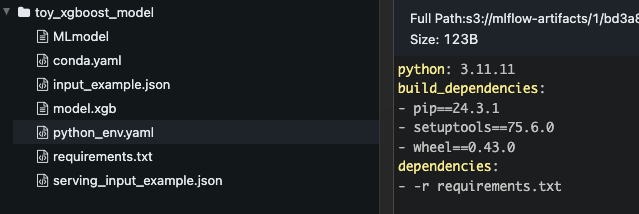
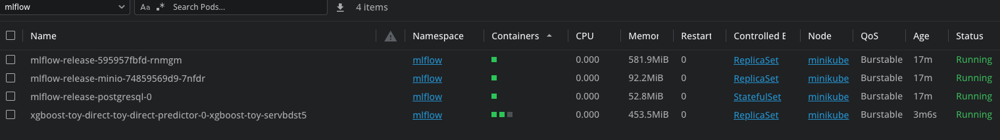
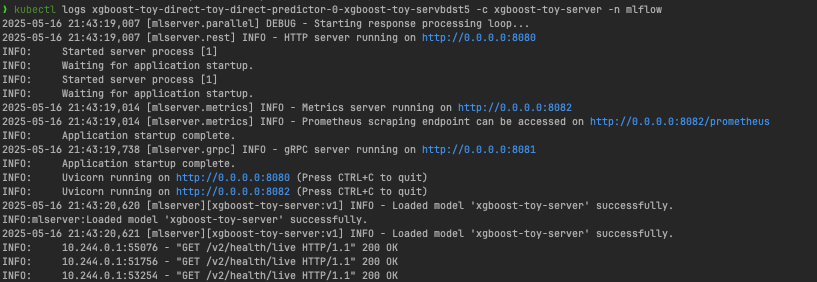

# Hands-On: Serving ML Models Like a Pro!

Welcome to this hands-on guide where we'll walk through the process of training, registering, and serving a machine learning model. We'll leverage powerful tools like MLflow, Minikube, Docker, Helm, Seldon Core, and MLServer to build a robust MLOps pipeline.

Let's get started!

## 1. Setting Up Your Environment

First things first, we need to get our local Kubernetes cluster and MLflow instance up and running.

**1.1. Start Minikube**

Fire up Minikube. We're allocating a decent amount of resources to ensure smooth operation.

```bash
minikube start --driver=docker --cpus=4 --memory=12g
```

**1.2. Set Docker Environment**

Configure your shell to use Minikube's Docker daemon.

```bash
eval $(minikube -p minikube docker-env)
```

**1.3. Build Custom MLflow Image**

We'll build a custom Docker image for MLflow. This example uses MLflow version 2.22.0.

```bash
docker build --build-arg MLFLOW_VERSION=v2.22.0 -t custom-mlflow:latest -f docker/mlflow/Dockerfile .
```

**1.4. Install MLflow using Helm**

Deploy MLflow to your Minikube cluster using its Helm chart. We'll create a dedicated `mlflow` namespace.

```bash
helm install mlflow-release ./helm-charts/mlflow \
    -f ./helm-charts/mlflow/values.yaml \
    -n mlflow --create-namespace \
    --timeout 10m
```

You should see something like this, indicating MLflow is being deployed:


**1.5. Port Forwarding**

To access MLflow UI and MinIO (our artifact store), forward their respective ports:

*   MLflow: `kubectl port-forward -n mlflow service/mlflow-release 5000:5000`
*   MinIO: `kubectl port-forward -n mlflow service/mlflow-release-minio 9000:9000`



You should already have some artifacts in MinIO if you've run previous experiments.


## 2. Model Training & Registration

Now, let's train a sample model and register it with MLflow.

**2.1. Run the XGBoost Toy Model Notebook**

Navigate to the `benchmarks/xgboost_toy_model.ipynb` notebook. Before running it, ensure you adjust any port configurations within the notebook if necessary (e.g., if you forwarded to different local ports). Then, run all the cells.

This notebook will train an XGBoost classifier and log it to your MLflow instance.

**2.2. Model Promoted to MinIO**

Once the model is trained and logged, it should be registered and "promoted" (in a conceptual sense, or by moving it to a 'production' stage in MLflow if you've set that up). The artifacts will be stored in MinIO.



This means you'll get an S3 URI pointing to your model's location, for example:
`s3://mlflow-artifacts/1/bd3a8eb65ae04a4fba353ef3d18ac32d/artifacts/toy_xgboost_model`

**2.3. Understanding the Packaged Model**

MLflow packages the model in a standardized format. Notice that the model files are not compressed by default.


This standardized package includes all crucial metadata: model inputs, outputs, dependencies, and more.



This S3 URI is key for the next steps, as we'll use it to download and deploy the model.

## 3. Model Deployment with Seldon Core & MLServer

We'll use Seldon Core on Kubernetes, with MLServer as the inference server, to deploy our model.

**3.1. Install Seldon Core Operator**

First, install the Seldon Core operator in your Kubernetes cluster. This operator will manage our model deployments.

```bash
helm install seldon-core seldon-core-operator \
    --namespace seldon-system \
    --set usageMetrics.enabled=false \
    --repo https://storage.googleapis.com/seldon-charts
```

**3.2. Build Custom MLServer Image**

We need a custom Docker image for MLServer that includes any specific dependencies for our model.

```bash
docker build -t ml-server:latest -f docker/mlserver/Dockerfile .
```

**3.3. Apply Rclone Secret**

To allow Seldon's init-container to download the model artifacts from MinIO (our S3-compatible registry), we need to provide credentials. Apply the Kubernetes secret for Rclone:

```bash
kubectl apply -f ./k8s-manifests/secrets/seldon-init-rclone-secret.yaml -n mlflow
```
*Note: Ensure the secret in `seldon-init-rclone-secret.yaml` is correctly configured for your MinIO setup.*

**3.4. Configure and Deploy Your Model**

Model deployment manifests are typically stored in a dedicated folder like `model-deployments`. For production, this might even be a separate repository.

*   Navigate to `model-deployments/xgboost-toy-classifier/`.
*   Review and customize `values.yaml`. This file tells Seldon where to find your model (using the S3 URI from earlier) and how to serve it.
    *   The `values.yaml` file should point to your promoted model URI.
    *   It's good practice to associate a Git commit hash with deployments for auditability and version tracking.

*Heads up:* In this example, both MLflow and the model deployment reside in the `mlflow` namespace. In a production environment, you might use different namespaces for better isolation and management.

Now, deploy your model using Helm and your customized values:

```bash
helm install xgboost-toy-direct-release ./helm-charts/seldon-model \
    -f ./model-deployments/xgboost-toy-classifier/values.yaml \
    -n mlflow
```

After a short while, you'll see an extra pod running in the `mlflow` namespace – this is your model server!

You can check its logs to ensure everything started correctly.


Your model is now live and ready to serve inferences via gRPC and HTTP!

## 4. Running Inference

Let's test our deployed model by sending an inference request.

**4.1. Forward the HTTP Port**

First, forward the port of your Seldon deployment to access it locally. The service name will typically be `xgboost-toy-direct-release-xgboost-toy-server` (or similar, based on your Helm release and model names) and it usually serves on port `8080` or `8081` internally, which Seldon then exposes via a gateway (often on port 8080 if it's the first model).

A common way to find the service and port-forward (assuming your Seldon deployment's service is named `xgboost-toy-direct-release-xgboost-toy-server` and you want to access it on local port `8080`):

```bash
kubectl port-forward -n mlflow service/xgboost-toy-direct-release-xgboost-toy-server 8080:8080 
# Or check the Seldon deployment for the correct service name and container port
```
*Adjust the service name and ports as per your specific Seldon deployment details.*

**4.2. Send an Inference Request**

Here's a Python script to send a sample request:

```python
import requests
import json

url = "http://localhost:8080/v2/models/xgboost-toy-server/infer" # Ensure model name matches your deployment

payload = json.dumps({
  "id": "aaabbb",
  "inputs": [
    {
      "name": "feature_0",
      "shape": [2, 1],
      "datatype": "FP64",
      "data": [-0.0612, 0.9996]
    },
    {
      "name": "feature_1",
      "shape": [2, 1],
      "datatype": "FP64",
      "data": [0.7793, 0.8524]
    },
    {
      "name": "feature_2",
      "shape": [2, 1],
      "datatype": "FP64",
      "data": [-0.5737, 0.4726]
    },
    {
      "name": "feature_3",
      "shape": [2, 1],
      "datatype": "FP64",
      "data": [0.5228, 1.0291]
    },
    {
      "name": "feature_4",
      "shape": [2, 1],
      "datatype": "FP64",
      "data": [1.5905, 0.2242]
    }
  ]
})
headers = {
  'Content-Type': 'application/json'
}

response = requests.request("POST", url, headers=headers, data=payload)

print(response.text)
```

**4.3. Expected Response**

You should receive a JSON response similar to this:

```json
{
    "model_name": "xgboost-toy-server",
    "model_version": "v1",
    "id": "aaabbb",
    "parameters": {
        "content_type": "np"
    },
    "outputs": [
        {
            "name": "output-1",
            "shape": [
                2,
                1
            ],
            "datatype": "FP32",
            "parameters": {
                "content_type": "np"
            },
            "data": [
                0.7401061058044434,
                0.9066746234893799
            ]
        }
    ]
}
```

Congratulations! You've successfully deployed and tested an ML model using a modern MLOps stack.
